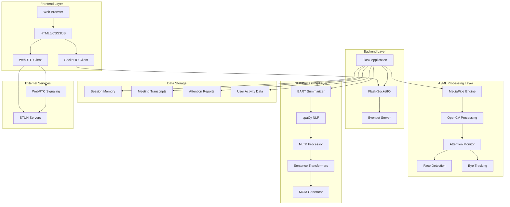
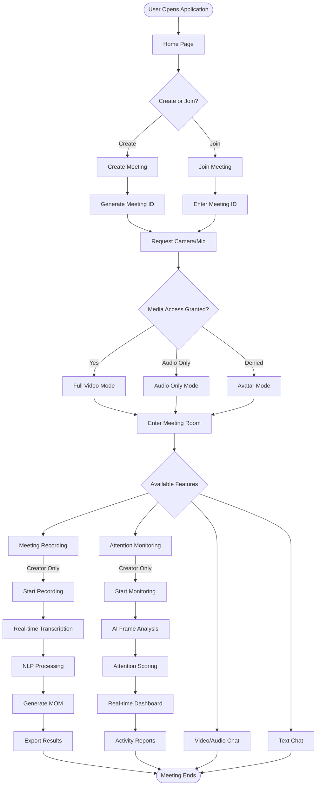
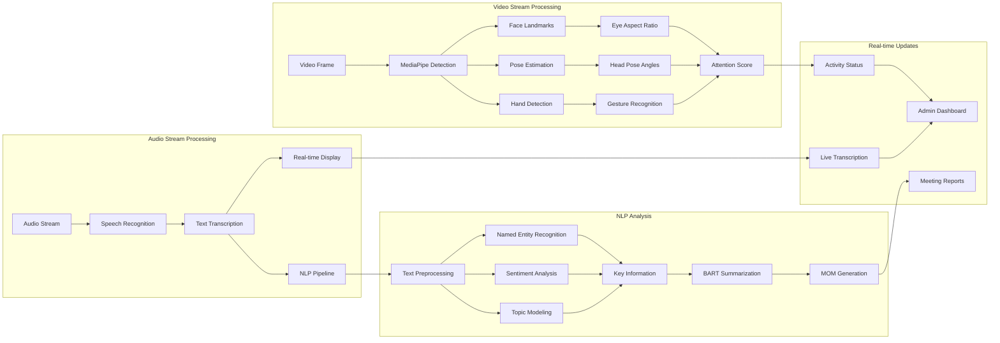
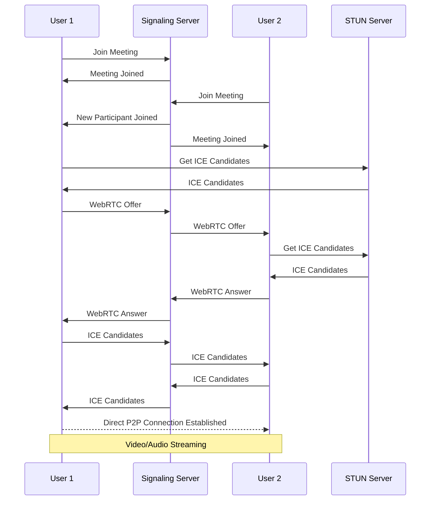
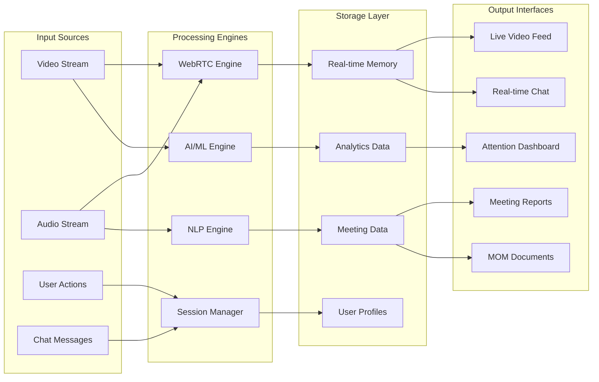
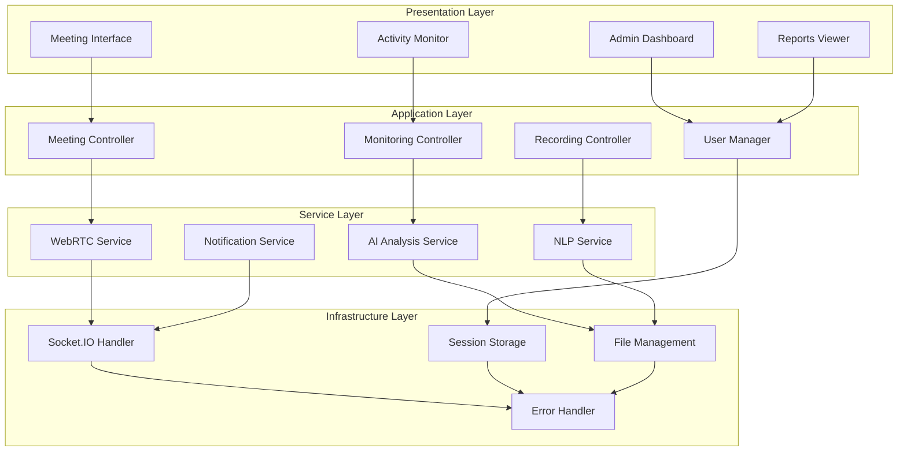
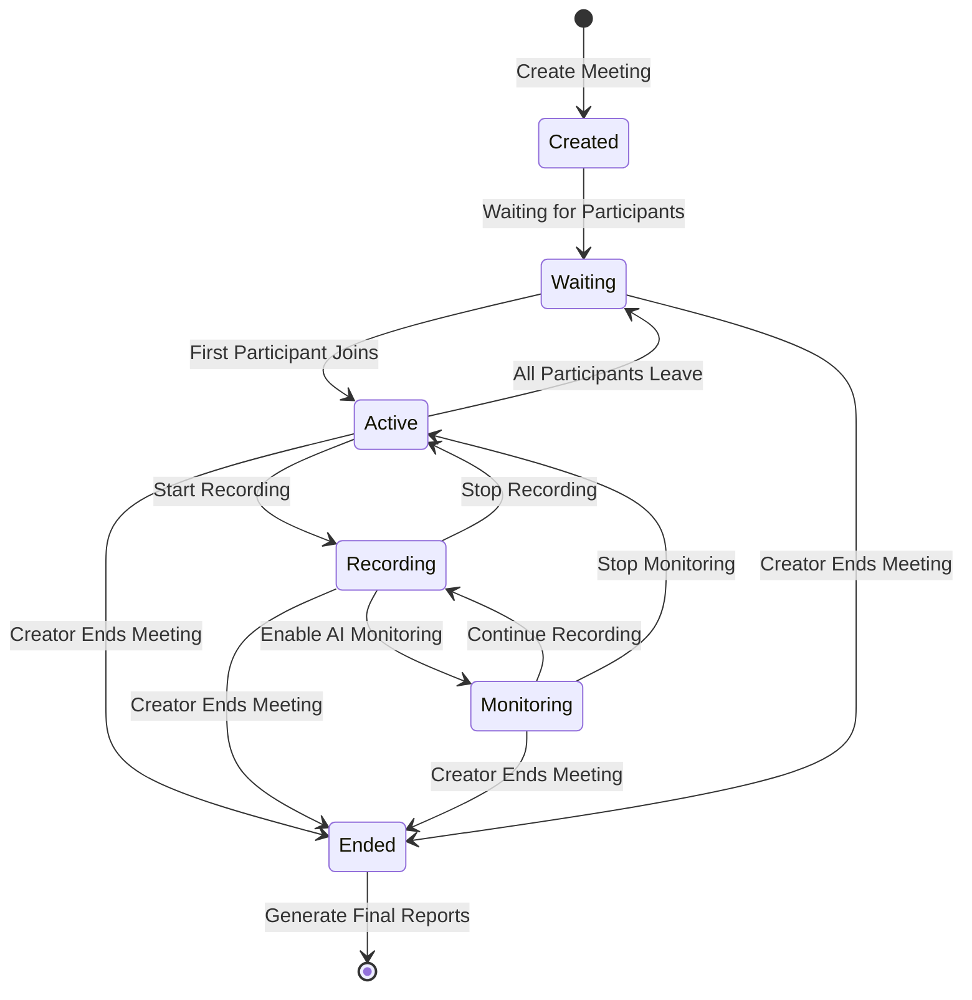
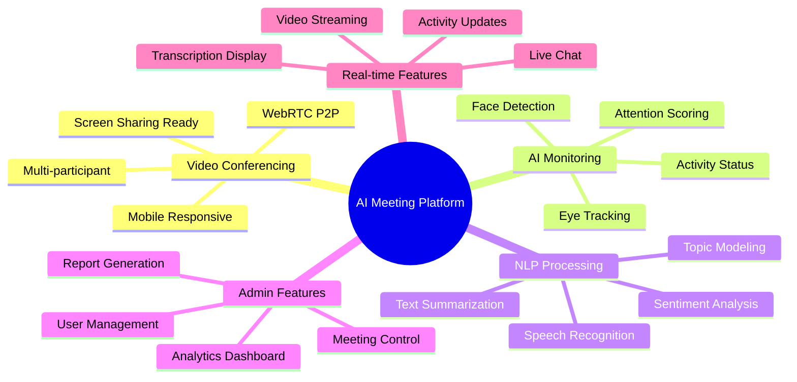
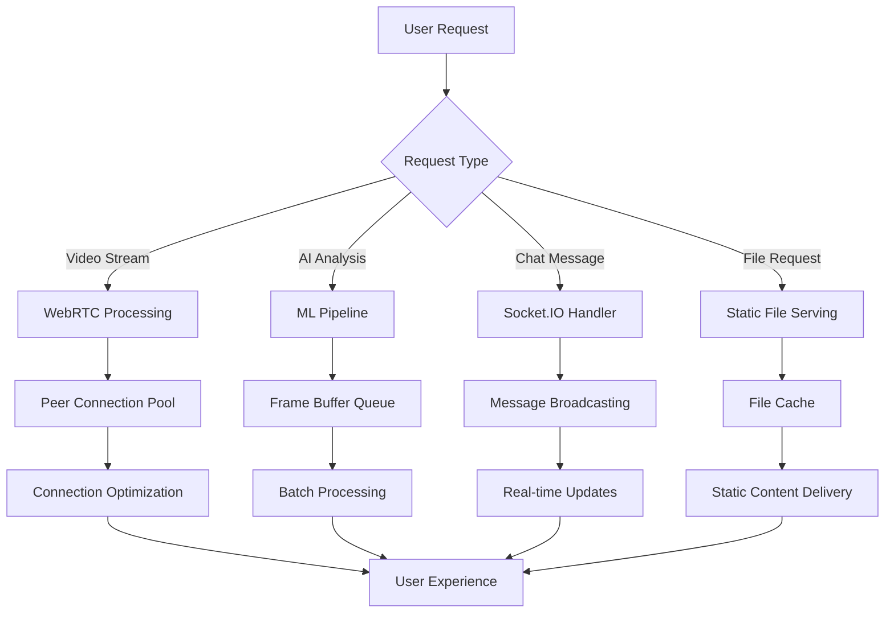

# Project Architecture & Flow Diagrams

## 🏗️ System Architecture Diagram

## 🔄 Application Flow Diagram

## 🧠 AI Processing Pipeline

## 🔌 WebRTC Connection Flow

## 📊 Data Flow Architecture

## 🏛️ Component Architecture

## 🔄 Meeting Lifecycle

## 🎯 Feature Integration Map

## 📈 Performance Optimization Flow

